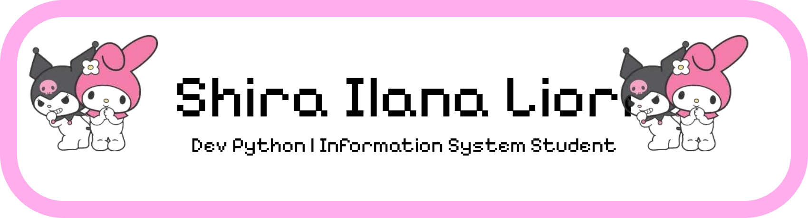

## Hiiii!! My name is Shira Ilana Liori Reis Orenstein de Araujo Cohen 💖

### 💖 About me!! :3

Welcome to my profile! I’m really passionate about programming and arts. I love creating things, bringing ideas to life, and exploring new technologies. Programming is something I genuinely enjoy, especially when I’m solving problems and building cool projects.
I’m currently a student and always trying to learn more and improve my skills. I have experience with Python programming and Artificial Intelligence, and I’m always looking for new ways to grow. In the future, I want to become a Data Analyst, using data to understand problems, find insights, and create meaningful solutions.
I also love mixing logic with creativity, which is why I enjoy both programming and arts so much — it lets me express ideas in different and unique ways. I’m always curious, motivated, and excited to keep learning!
---
### 🎂 18 years old  
### 🎓 Student at UDF
### Skills:  
- Python programming  
- Artificial Intelligence  
---
### 📧 Contact: [shirailanaliori@gmail.com](mailto:shirailanaliori@gmail.com)  
---  

Feel free to reach out and talk to me! 💕
